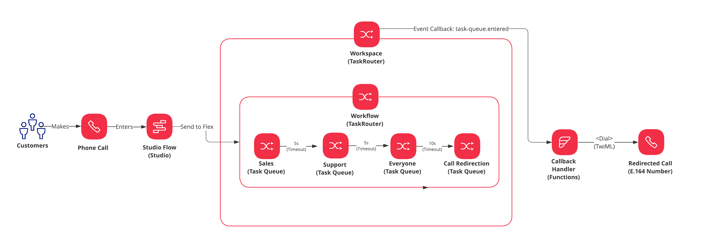
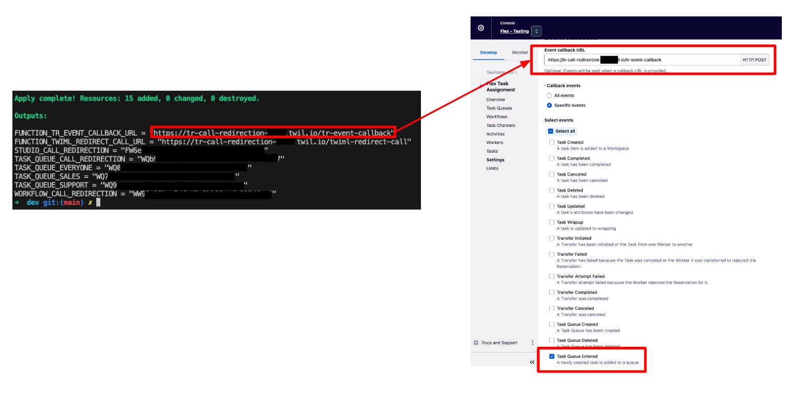
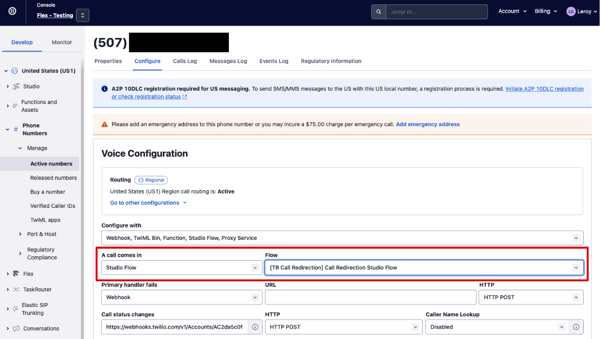
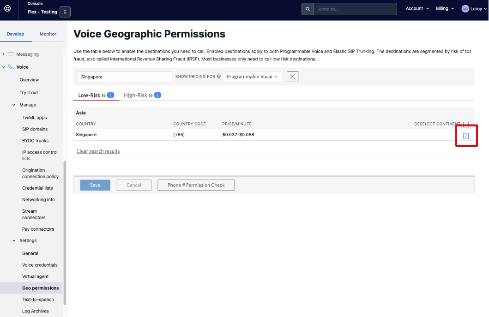

# Twilio Flex - Routing - Redirect Calls When No Agents Are Available

Solution to fulfill redirecting voice calls to an E.164 number when no agents, across all task queues, accepted the incoming call. This repository features a terraform template that creates new independent Twilio resources required to demostrate the solution.



Key Solution Components:

1. _Placeholder Task Queue_: Inserted at the last step of a TaskRouter Workflow to indicate that the call is ready to be routed to a E.164 number. No workers should be matched to this Task Queue.
2. _TaskRouter Event Callback Handler_: Responsible for detecting tasks that entered the placeholder task queue and redirect the in-progress call, via TwiML's `<Dial>` verb, to an E.164 number

---

## Pre-requisites

1. Twilio Flex Account ([Guide](https://support.twilio.com/hc/en-us/articles/360020442333-Setup-a-Twilio-Flex-Account))
2. Node.js v16.x.x only ([Guide](https://docs.npmjs.com/downloading-and-installing-node-js-and-npm))
3. Terraform v1.4.6 and above ([Guide](https://developer.hashicorp.com/terraform/tutorials/aws-get-started/install-cli))

## Terraform

Within this terraform template, it will create all the required resources to demostrate the solution. You can safely perform `terraform destroy` without having to worry about deleting any existing Twilio resources that you already have.

All resources created will be prefixed with `[TR Call Redirection]` for easy identification.

The following resources are created as part of the Terraform template:

| Friendly Name                                      | Resource Type | Description                                                                                                                                              |
| -------------------------------------------------- | ------------- | -------------------------------------------------------------------------------------------------------------------------------------------------------- |
| [TR Call Redirection] Sales                        | Task Queue    | Acts as an initial task queue when a call comes in                                                                                                       |
| [TR Call Redirection] Support                      | Task Queue    | Acts as the second layer of task queue if agents within the sales task queue are unavailable                                                             |
| [TR Call Redirection] Everyone                     | Task Queue    | Acts as the last layer of task queue by broadcasting the task to every agent                                                                             |
| [TR Call Redirection] Call Redirection             | Task Queue    | Placeholder task queue to indicate that the call is now ready to be redirected to another E.164 number. No workers should be matched to this task queue. |
| [TR Call Redirection] Call Redirection Workflow    | Workflow      | TaskRouter workflow that includes all the Task Queues created                                                                                            |
| [TR Call Redirection] Call Redirection Studio Flow | Studio Flow   | Studio Flow for integration into any active Twilio number to demostrate the solution                                                                     |
| [TR Call Redirection] Callback Handler             | Functions     | Event Callback Handler to be inserted into TaskRouter's Workspace Callback URL                                                                           |

---

## Step 1: Deploy Required Resources Using Terraform

Ensure that you have the following values before proceeding:

1. E.164 Number for Redirection
2. Twilio Flex Account SID
3. Twilio Flex Account Auth Token

On your terminal, perform the following:

```
// Clone Project
git clone https://github.com/leroychan/twilio-flex-routing-redirect-call

// Change to working directory
cd twilio-flex-routing-redirect-call

// Change to terraform working directory
cd terraform/environments/dev

// Terraform - Init
terraform init

// Terraform - Plan
terraform plan

// Terraform - Deploy
terraform deploy

```

## Step 2: Configure TaskRouter Event Callback URL

Based on the output of `terraform deploy`, configure `Console > TaskRouter > Workspace ("Flex Task Assignment") > Settings > Event callbacks` with the following:

1. Event callback URL: `Value of FUNCTION_TR_EVENT_CALLBACK_URL from Terraform's Output`
2. Event: `Task Queue Entered`



## Step 3: Configure Active Twilio Number to Studio Flow Created

Navigate over to `Console > Phone Numbers > Manage > Active Numbers`:

1. Choose a phone number that you would like to be used for the solution demostration.
2. Set the `Voice Configuration` for `A call comes in` to be `Studio Flow`
3. For the `Flow`, select `[TR Call Redirection] Call Redirection Studio Flow`



## Step 4: Ensure Geo Permissions has been enabled for the country of the redirection number

Navigate over to `Console > Voice > Settings > Geo permissions`

1. Enable the country that your redirection number is in



## Step 5: Done !

You are now ready to start testing the redirection of calls when no agents are available.

Start by calling the E.164 Number configured for Twilio Flex (from Step 3), after about 20 seconds wait, the redirection number should start ringing !

---

## License

MIT
